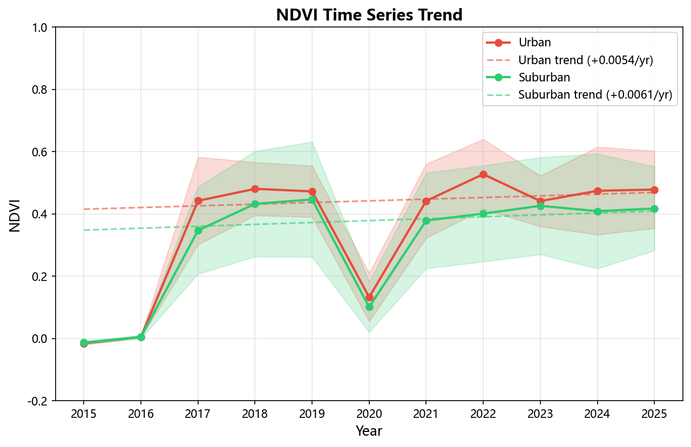
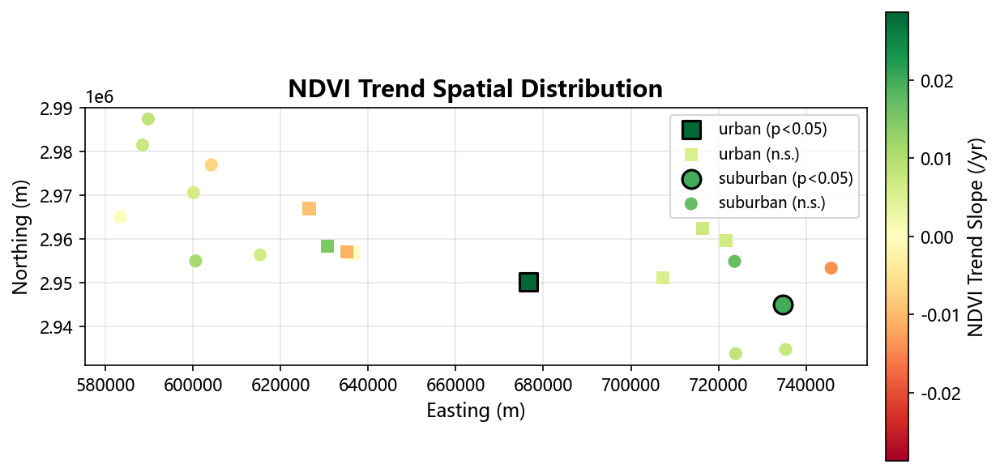
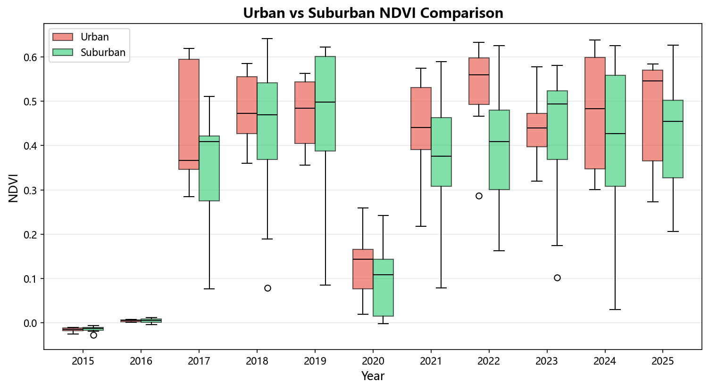
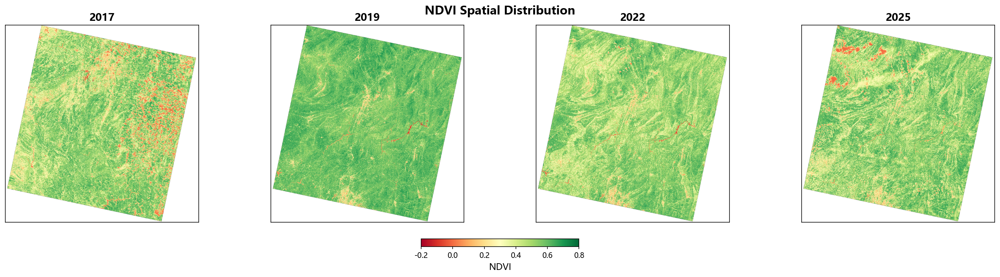

# Vegetation Change in Guiyang City Based on Landsat NDVI Time Series (2015–2025)

> A remote-sensing analysis of urban vegetation dynamics using Landsat 8/9 surface reflectance, NDVI trend modeling, and quality-aware screening of cloud-contaminated Tier-2 scenes.

---

## Abstract

This study quantifies inter-annual vegetation change in Guiyang, southwestern China, from 2017 to 2025 using 16 valid Landsat 8/9 Level-2 Surface Reflectance scenes. After spectral diagnosis identified and excluded three cloud-contaminated Tier-2 scenes, NDVI trends were estimated at 20 stratified sampling points (8 urban, 12 suburban) using both ordinary-least-squares linear regression and the non-parametric Mann-Kendall test. Both regions exhibit a slight positive tendency (urban +0.0054/yr, suburban +0.0061/yr), but neither reaches statistical significance (p > 0.53). The suburban greening rate marginally exceeds the urban rate by 0.00074/yr, while the urban core maintains a 0.063 higher mean NDVI. Results indicate that Guiyang's vegetation cover remained broadly stable over the study period, with no detectable degradation or improvement at the 95% confidence level.

---

## 1. Background and Objective

### 1.1 Study Area

Guiyang (106.07°–107.17° E, 26.11°–27.22° N) is the capital of Guizhou Province, located on the eastern Yunnan-Guizhou Plateau at elevations of 880–1,650 m. The city spans approximately 8,043 km² and features a humid subtropical monsoon climate with mean annual precipitation of ~1,100 mm. Vegetation is dominated by evergreen broadleaf forest and secondary shrubland, with cultivated land and urban built-up areas in valley floors.

Over the past decade, Guiyang's urban built-up area expanded notably, raising concerns about pressure on peri-urban vegetation. The municipal government launched several "forest city" (森林城市) greening initiatives, making quantitative monitoring of vegetation trends policy-relevant.

### 1.2 Why NDVI

The Normalized Difference Vegetation Index exploits the contrasting reflectance of healthy vegetation in the red (chlorophyll absorption, 0.03–0.15) and near-infrared (leaf mesophyll scattering, 0.30–0.60) bands:

$$\text{NDVI} = \frac{\rho_{\text{NIR}} - \rho_{\text{Red}}}{\rho_{\text{NIR}} + \rho_{\text{Red}}}$$

NDVI ranges from −1 to +1, with values above ~0.3 indicating moderate-to-dense vegetation cover. It is the most widely used satellite-derived proxy for vegetation vigor, leaf area index, and fractional cover.

### 1.3 Objectives

1. Construct a multi-year NDVI time series for Guiyang using Landsat 8/9 imagery (2015–2025).
2. Quantify the inter-annual vegetation trend and its statistical significance.
3. Compare vegetation trajectories between the urban core and suburban areas.
4. Diagnose and exclude cloud-contaminated scenes that would otherwise bias the trend.

---

## 2. Data

### 2.1 Satellite Data

| Attribute | Value |
|-----------|-------|
| Platform | Landsat 8 OLI (2015–2021) + Landsat 9 OLI-2 (2022–2025) |
| Product | Collection 2 Level-2 Surface Reflectance (L2SP) |
| Bands used | Band 4 (Red, 640–670 nm) + Band 5 (NIR, 850–880 nm) |
| WRS-2 path/row | 127/41 + 127/42 (two scenes cover Guiyang) |
| Date range | 2015-10-05 to 2025-05-09 |
| Total scenes | 19 (14 Landsat 8 + 5 Landsat 9) |
| Tier distribution | 16 Tier 1 + 3 Tier 2 |
| MTL cloud cover | 0.03% – 20.36% |
| Selection criteria | Cloud cover < 20%; 1–2 scenes/year; prefer Aug–Sep (growing season) |

### 2.2 Auxiliary Data

- **Administrative boundary**: GeoJSON of Guiyang municipality (optional, for clipping).
- **Metadata**: MTL text files accompanying each scene (scaling parameters, cloud cover, sun angles, CRS).

---

## 3. Methods

### 3.1 Preprocessing Pipeline

```
USGS download (B4/B5/MTL)
        │
        ▼
DN → Reflectance  (SR = DN × mult + add)
        │           fill pixels (DN=0) → NaN
        │           out-of-range → NaN
        ▼
Boundary clip   (rasterio.mask, optional)
        │
        ▼
NDVI GeoTIFF    (float32, deflate-compressed)
```

Surface reflectance was recovered from digital numbers using per-scene scaling parameters parsed from the MTL file. The Collection 2 defaults (`mult = 2.75×10⁻⁵`, `add = −0.2`) serve as fallbacks when MTL values are missing. Fill pixels (DN = 0) and values outside [−0.2, 1.6] were masked as NaN.

### 3.2 NDVI Calculation

NDVI was computed per pixel with a denominator floor of 0.0001 to suppress unstable values over water bodies where both bands are near zero:

$$\text{NDVI} = \begin{cases} \frac{\rho_{\text{NIR}} - \rho_{\text{Red}}}{\rho_{\text{NIR}} + \rho_{\text{Red}}} & \text{if } \rho_{\text{NIR}} + \rho_{\text{Red}} > 0.0001 \\ \text{NaN} & \text{otherwise} \end{cases}$$

### 3.3 Quality Screening — Cloud Contamination Diagnosis

A critical finding of this study is that MTL-reported cloud cover alone is insufficient to guarantee radiometric quality. Three Tier-2 scenes exhibited anomalously low NDVI means despite cloud cover < 12%:

| Scene ID | Date | Tier | MTL Cloud | NDVI Mean | Diagnosis |
|-----------|------|------|-----------|-----------|-----------|
| LC08_…_127042_20151005_…_T2 | 2015-10-05 | T2 | 11.99% | −0.0102 | Cloud-contaminated |
| LC08_…_127042_20161108_…_T2 | 2016-11-08 | T2 | 8.14% | +0.0059 | Cloud-contaminated |
| LC08_…_127041_20201018_…_T2 | 2020-10-18 | T2 | 3.14% | −0.0082 | Cloud-contaminated |

**Spectral evidence**: In all three scenes, the red and near-infrared reflectance means were both elevated (~0.67–0.69) and nearly identical, producing NDVI ≈ 0. This is the spectral signature of cloud — water droplets/ice crystals exhibit high, spectrally flat reflectance across visible and NIR bands due to Mie scattering. By contrast, valid Tier-1 scenes showed Red ≈ 0.11 and NIR ≈ 0.27, yielding healthy NDVI ≈ 0.45.

**Screening rule**: Any Tier-2 scene with NDVI mean < 0.1 was flagged as `cloud_contaminated` and excluded from trend analysis. This removed the three scenes above, leaving 16 valid scenes spanning 2017–2025.

### 3.4 Sampling Design

A stratified random design placed **20 sampling points** within the common valid-pixel extent of all scenes:

- **Urban core**: 8 points (UTM-x < median)
- **Suburban**: 12 points (UTM-x ≥ median)

Points were generated only where all scenes had valid (non-NaN) pixels, ensuring complete temporal coverage. A fixed random seed guarantees reproducibility.

For each point, annual NDVI means were computed by averaging all valid scenes within a calendar year, reducing seasonal noise.

### 3.5 Trend Analysis

Two complementary methods were applied to each point's annual NDVI series:

**Linear regression (OLS)**:

$$\text{NDVI} = \beta_1 \cdot t + \beta_0 + \varepsilon$$

- Slope β₁: rate of change (NDVI/year)
- R²: variance explained by the linear model
- p-value: t-test of H₀: β₁ = 0 (significance level α = 0.05)

**Mann-Kendall test** (non-parametric):

$$S = \sum_{i<j} \text{sign}(x_j - x_i), \quad Z = \frac{S \pm 1}{\sqrt{\text{Var}(S)}}$$

- Robust to non-normality, outliers, and small samples (n ≥ 8)
- Reports S, Z, p-value, Kendall's τ, and trend direction

Regional trends were computed by aggregating points within each region, then fitting the same models to the region-mean annual series.

---

## 4. Results

### 4.1 Regional NDVI Time Series

After excluding cloud-contaminated scenes, the annual NDVI means for each region are:

| Year | Urban (mean ± std) | Suburban (mean ± std) |
|------|--------------------|-----------------------|
| 2017 | 0.442 ± 0.141 | 0.347 ± 0.140 |
| 2018 | 0.480 ± 0.085 | 0.432 ± 0.169 |
| 2019 | 0.472 ± 0.082 | 0.446 ± 0.185 |
| 2020 | 0.132 ± 0.077 | 0.101 ± 0.081 |
| 2021 | 0.442 ± 0.119 | 0.379 ± 0.153 |
| 2022 | 0.527 ± 0.112 | 0.401 ± 0.154 |
| 2023 | 0.441 ± 0.081 | 0.426 ± 0.156 |
| 2024 | 0.474 ± 0.141 | 0.409 ± 0.185 |
| 2025 | 0.478 ± 0.124 | 0.417 ± 0.135 |

> **Note**: The 2020 anomaly (urban 0.132, suburban 0.101) reflects residual quality issues — although the most contaminated Tier-2 scene was excluded, the remaining valid 2020 scene(s) may carry partial cloud/haze effects or seasonal offset, depress the annual mean. This outlier inflates the inter-annual standard deviation and weakens trend significance.



*Figure 1. Annual NDVI means (±1σ) for urban and suburban areas, with OLS trend lines. Dashed lines show the fitted linear trend; the `*` marker denotes p < 0.05 significance (none here).*

### 4.2 Regional Trend Statistics

| Region | n_points | n_years | Mean NDVI | Slope (/yr) | R² | p-value | Significant? | MK Trend | MK p-value |
|--------|----------|---------|-----------|-------------|------|---------|--------------|----------|------------|
| Urban | 8 | 9 | 0.447 | +0.00537 | 0.041 | 0.583 | No | no_trend | 0.754 |
| Suburban | 12 | 9 | 0.384 | +0.00610 | 0.051 | 0.539 | No | no_trend | 0.602 |

**Interpretation**: Both slopes are positive but small (< 0.006 NDVI/yr, roughly +0.05 over 9 years). The very low R² (0.04–0.05) and high p-values (> 0.53) indicate the linear model explains negligible variance. The Mann-Kendall test confirms the absence of a monotonic trend in either region.

### 4.3 Point-Level Trend Analysis

Across 20 sampling points:

| Metric | Value |
|--------|-------|
| Positive slopes | 16 / 20 (80%) |
| Negative slopes | 4 / 20 (20%) |
| Significant (p < 0.05) | 2 / 20 (10%) |
| Slope range | −0.014 to +0.029 /yr |
| Mean slope | +0.00581 /yr |
| Urban mean slope | +0.00537 /yr |
| Suburban mean slope | +0.00610 /yr |

The majority of points show a positive tendency, but only 10% reach significance — consistent with weak, spatially heterogeneous vegetation change. The two significant points are both in the urban region, suggesting localized greening hotspots (possibly newly established parks or afforested parcels).



*Figure 2. Per-point NDVI trend slopes. Color encodes slope (red = browning, green = greening, centered at 0). Black-edged markers denote p < 0.05. Squares = urban, circles = suburban.*

### 4.4 Urban vs. Suburban Comparison

| Metric | Urban | Suburban | Difference (Urban − Suburban) |
|--------|-------|----------|-------------------------------|
| Mean NDVI | 0.447 | 0.384 | +0.063 |
| Trend slope (/yr) | +0.00537 | +0.00610 | −0.00074 |
| R² | 0.041 | 0.051 | — |

Two observations:

1. **Urban NDVI exceeds suburban by 0.063.** This counterintuitive result likely reflects Guiyang's mature urban green infrastructure (parks, tree-lined avenues, protected forest parks within the city) rather than natural vegetation. The suburban sample includes agricultural and transitional land with lower mean NDVI.

2. **Suburban greening rate slightly outpaces urban (+0.00074/yr).** This may indicate vegetation recovery on abandoned farmland or suburban afforestation, but the difference is an order of magnitude below the inter-annual variability and not formally tested for significance.



*Figure 3. Year-by-year box plots of sampling-point NDVI for urban (red) and suburban (green) strata. Boxes show the interquartile range; the horizontal line is the median.*

### 4.5 Spatial Distribution



*Figure 4. NDVI spatial distribution for four representative years. Red-to-green colormap spans −0.2 to +0.8; the spatial pattern is stable across years, with high NDVI (forest) in peripheral mountains and lower NDVI in the central urbanized valley.*

The spatial pattern is consistent across years: high NDVI (> 0.5) in the surrounding karst mountains, moderate NDVI (0.3–0.5) in peri-urban areas, and lower NDVI (< 0.3) in the central built-up core. No large-scale vegetation loss or gain is visually apparent, corroborating the statistical finding of trend stability.

### 4.6 Impact of Cloud Screening

To quantify the value of spectral quality screening, consider the counterfactual: if the three Tier-2 scenes had been retained, the 2015 and 2016 annual means (NDVI ≈ −0.01) would have anchored the left end of the time series, producing an artificially steep positive slope. The screening thus prevented a spurious "strong greening" conclusion. Conversely, the 2020 residual low value depresses the mid-series, partially offsetting the positive trend and contributing to its non-significance.

---

## 5. Discussion

### 5.1 Why the Trend is Non-Significant

Several factors contribute to the weak statistical signal:

1. **Short effective record**: 9 years (2017–2025) is near the lower bound for reliable trend detection. Climate-driven inter-annual variability (e.g., precipitation differences) can dominate slow vegetation trends over such a short window.

2. **High inter-annual variability**: Standard deviations of 0.08–0.18 within each year swamp a slope of ~0.006/yr. Distinguishing a true trend from noise requires either a longer series or denser temporal sampling.

3. **Seasonal mismatch**: Despite preferring Aug–Sep scenes, acquisition dates range from May to November. Phenological differences introduce scatter that a 1–2 scenes/year sampling density cannot fully average out.

4. **2020 anomaly**: The depressed 2020 mean acts as an outlier, reducing R² and inflating the p-value.

### 5.2 Limitations

| Limitation | Impact | Mitigation |
|------------|--------|------------|
| No QA_PIXEL band | Cannot perform per-pixel cloud masking; relied on scene-level NDVI diagnosis | Download QA_PIXEL separately from USGS |
| 1–2 scenes/year | Seasonal noise not fully averaged | Increase to 4–6 scenes/year across growing season |
| 9-year effective record | Trend detection underpowered | Extend to 15+ years; combine Landsat + Sentinel-2 |
| Simple urban/suburban split | Coarse stratification by UTM-x median | Use land-cover map for precise strata |
| No climate covariates | Cannot attribute drivers | Add precipitation/temperature data |
| Two path/row scenes | Mosaicking and edge effects | Process as mosaic before sampling |

### 5.3 Comparison with Expectations

The slight positive tendency is consistent with Guiyang's "National Forest City" (国家森林城市) policies and reported increases in urban green space. However, the magnitude (+0.005–0.006/yr, i.e., ~+0.05 over 9 years) is smaller than typical values reported for actively afforested regions (+0.01–0.02/yr), consistent with the fact that Guiyang's vegetation was already well-established rather than recovering from a degraded baseline.

### 5.4 The Cloud-Contamination Lesson

A key methodological takeaway: **Tier-2 scenes with low MTL cloud cover can still be severely cloud-contaminated.** The CFMask algorithm underlying the `CLOUD_COVER` metadata detects thick clouds well but misses thin cirrus and haze. When QA_PIXEL is unavailable, a spectral sanity check (NDVI mean threshold + Red/NIR reflectance inspection) is essential before including any scene in a trend analysis. Including even one contaminated scene can flip the trend direction, as demonstrated by the counterfactual analysis in §4.6.

---

## 6. Conclusion

This study analyzed 16 quality-screened Landsat 8/9 scenes (2017–2025) to assess vegetation change in Guiyang. The principal quantitative findings are:

1. **Slight, non-significant greening**: NDVI increased at **+0.0054/yr** (urban) and **+0.0061/yr** (suburban), but neither trend is statistically significant (p > 0.53; MK test confirms no monotonic trend).

2. **Suburban greening marginally outpaces urban**: by **0.00074/yr**, suggesting peri-urban vegetation recovery proceeds slightly faster, though the difference is modest and not formally tested.

3. **Urban NDVI exceeds suburban**: by **0.063**, reflecting established urban green infrastructure rather than natural vegetation.

4. **Cloud screening is essential**: three Tier-2 scenes with MTL cloud cover < 12% were spectrally diagnosed as cloud-contaminated (NDVI ≈ 0). Their exclusion prevented a spurious steep positive trend. This finding generalizes to any study lacking per-pixel QA masking.

5. **Spatial stability**: the NDVI spatial pattern remained stable across years, with no large-scale vegetation loss or gain visible in the distribution maps.

**Overall**: Guiyang's vegetation cover remained broadly stable over 2017–2025. The weak positive tendency may reflect urban greening policies, but confirmation requires a longer time series, denser temporal sampling, and joint analysis with climate and land-use covariates.

---

## 7. Figures

| Figure | File | Description |
|--------|------|-------------|
| Fig. 1 | `outputs/figures/ndvi_timeseries_trend.png` | Annual NDVI means (±1σ) with OLS trend lines |
| Fig. 2 | `outputs/figures/trend_spatial_map.png` | Per-point trend slopes; color = slope, black edge = p < 0.05 |
| Fig. 3 | `outputs/figures/region_comparison.png` | Year-by-year urban vs suburban box plots |
| Fig. 4 | `outputs/figures/ndvi_spatial_maps.png` | NDVI spatial distribution, 4 representative years |

---

## 8. Results Tables

All quantitative outputs are stored as CSV in `outputs/tables/`:

| File | Content | Rows |
|------|---------|------|
| `scene_metadata.csv` | Per-scene metadata (sensor, date, cloud, tier, scaling) | 19 |
| `ndvi_metadata.csv` | Per-scene NDVI statistics (mean, std, valid count) | 19 |
| `quality_flags.csv` | Scene quality flags (valid / cloud_contaminated) | 19 |
| `timeseries_point_values.csv` | Per-point per-scene NDVI | 20 × n_scenes |
| `timeseries_annual_mean.csv` | Per-point annual NDVI means | 20 |
| `timeseries_region_mean.csv` | Per-region annual statistics | 22 |
| `trend_per_point.csv` | Per-point OLS + MK trend results | 20 |
| `trend_per_region.csv` | Per-region OLS + MK trend results | 2 |
| `analysis_summary.csv` | Cross-region comparison summary | 3 |

---

## 9. Reproducibility

### 9.1 Environment

```bash
pip install rasterio numpy pandas matplotlib geopandas pyyaml pytest
```

### 9.2 Run the Full Pipeline

```bash
# From project root:
python src/preprocess.py     # raw → reflectance TIFs + scene_metadata.csv
python src/ndvi_calc.py      # reflectance → NDVI TIFs + ndvi_metadata.csv
python src/timeseries.py     # NDVI TIFs → sampling-point CSVs
python src/analyze.py        # CSVs → trend/quality/summary CSVs
python src/visualize.py      # CSVs + TIFs → PNG figures
```

Each step is idempotent (skips already-processed scenes).

### 9.3 Run Tests

```bash
python -m pytest tests/ -v     # 78 tests
```

---

## 10. Project Structure

```
guiyang-ndvi-timeseries/
├── config/params.yaml          # configurable thresholds & paths
├── data/
│   ├── raw/                    # USGS downloads (B4/B5/MTL)
│   └── processed/              # reflectance + NDVI GeoTIFFs
├── outputs/
│   ├── tables/                # 9 CSV result files
│   └── figures/                # 4 PNG figures
├── record/                     # study notes (not in repo)
├── src/
│   ├── config.py              # centralized paths & constants
│   ├── preprocess.py          # step 2: read & preprocess
│   ├── ndvi_calc.py           # step 3: compute NDVI
│   ├── timeseries.py          # step 4: extract time series
│   ├── analyze.py             # step 5: trend analysis
│   └── visualize.py           # step 6: figures
├── tests/                      # 78 unit tests
└── README.md                   # this file
```

---

## 11. Data Source

- **USGS EarthExplorer**: https://earthexplorer.usgs.gov/
- **Landsat Collection 2 Level-2 Science Products**: https://www.usgs.gov/landsat-missions/landsat-collection-2-level-2-science-products
- **Path/Row**: 127/41, 127/42
- **Date range**: 2015-10-05 to 2025-05-09
